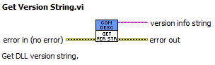
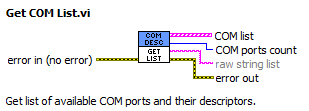
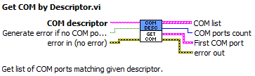
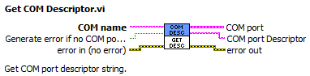
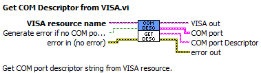
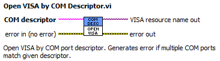

# Get COM port User Descriptor String

This is simple tool to obtain USB-COM port user programmed descriptor string for Windows.
It was created to ease the use of many COM ports on a computer as it is quite a pain to identify which one is which. I hate SW that tries to identify COM port by opening all ports and sending rubbish data to all of them until one responds the way that is expected. Fortunately, these days most devices with COM port uses USB-COM bridge chips. These chips almost always have possibility to programm user descriptor string to the chip's EEPROM, either internal or external. This user string is then reported by the USB device in operating system. Problem is, that it is not easy to obtain the string (at least in Windows). Furthermore, there is no standardization, so various chip manufacturers report the user string in different places. E.g. common chips like Microchip [MCP2200](https://www.microchip.com/en-us/product/mcp2200) or Silicon Labs [CP2102N](https://www.silabs.com/interface/usb-bridges/usbxpress) reports the user string in COM port device class under descriptor 'BusReportedDeviceDesc'. But e.g. FTDI chips, like [FT232H](https://ftdichip.com/products/ft232hq/) reports this string in USB device class and not in the child COM port device so it has to somehow paired. This tool is trying to deal with this for known chips and make unified interface of obtaining the user string. 

## C++ library

Library was programmed using MSVC 2019. The tool was build as a simple console application [get_com_descriptor](./msvc). It can report list of all COM port devices with their descriptor strings. 
Example:
```
get_com_descriptor.exe -list
```
will report e.g.:
```
COM2    AX99100 PCIe to High Speed Serial Port
COM3    MK3-USB Interface
COM4    AX99100 PCIe to High Speed Serial Port
COM6    CP2102N(Toslink Bridge)
COM7    TFA Meteo Logger(CP2102N USB to UART)
COM8    CP2102N(DC bus TRX)
```
It can also return particular COM port's descriptor. Example:
```
get_com_descriptor.exe -name COM6
```
will return e.g.:
```
CP2102N(Toslink Bridge)
```
It can also work in reverse order by finding COM port(s) for given descriptor string. Example:
```
get_com_descriptor.exe -desc "AX99100 PCIe to High Speed Serial Port"
```
will return e.g.:
```
COM2
COM4
```

The library was also compiled to a DLL so it can be used in other environments. There are just few DLL entry points:
```
// DLL entry: get list of all COM ports to char buffer of max size
__int32 get_com_list(char* buf,__int32 size)

// DLL entry: get COM name(s) by descriptor string
__int32 get_com_by_desc(char* buf,__int32 size,char* desc)

// DLL entry: get COM port descriptor by COM name string
__int32 get_com_desc(char* buf,__int32 size,char* name)

// DLL entry: get lib version string
__int32 get_ver(char* buf, __int32 size)
```

### Known issues
I'm not sure how exactly to handle unicode strings. Windows API functions for extracting the descriptors are using wchar_t strings, but when I try to print to console using e.g. wprintf(), it generates some mess when localized characters are used. So, it is advisable to not use anything but basic ASCII for naming the devices...


## LabVIEW DLL wrapper
I use lot of COM port devices in LabVIEW projects, so I also made a simple DLL wrapper for LabVIEW 2020. See [Get COM Descritor.lvlib](./LabView/). NI VISA driver kind of can do it by itself, but as explained earlier, it does not work for all USB chips. There are just a few VIs. 














## License
All parts of the project are distributed under [MIT license](./LICENSE.txt).
